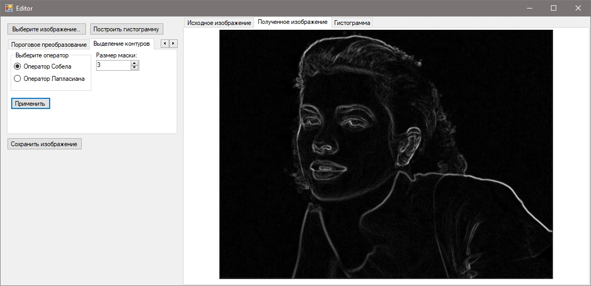
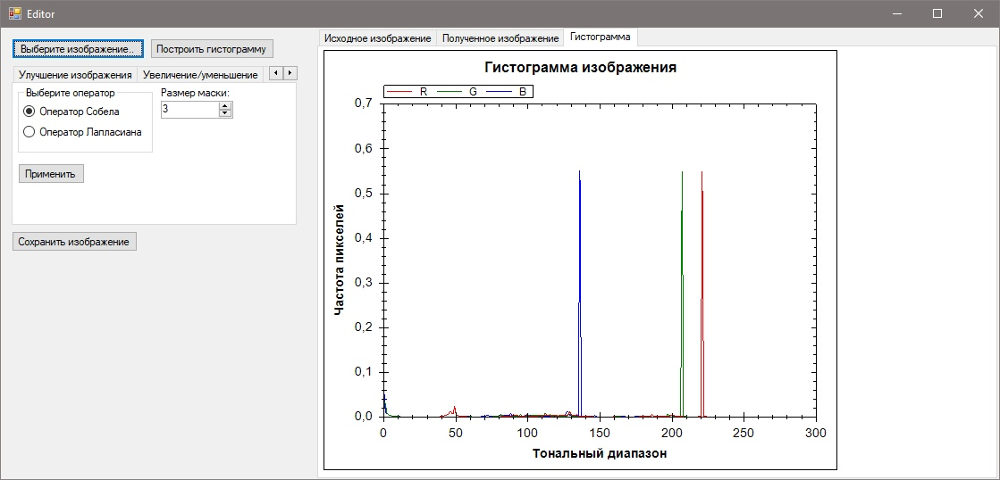

# imageeditor
Image editor with filters, resize methods, noise reduction, histogram and etc.

Редактор изображений с возможностями фильтрации и изменения размеров изображения, подавления шумов и построением гистрограммы и т.д.

Для запуска перейдите в Nazarova\bin\Debug и запустите Nazarova.exe

Пример работы программы:

E-mail автора: liudmila181196@gmail.com
